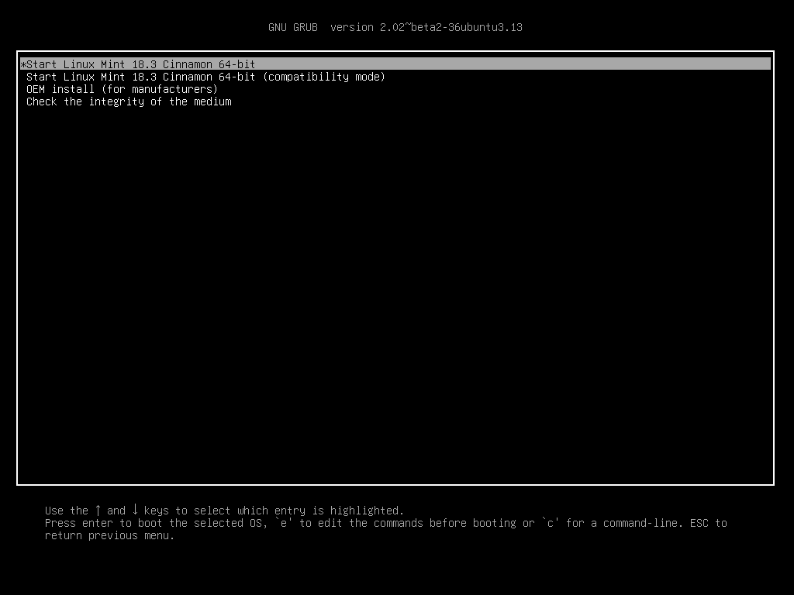

启动Linux
===============

现在您在U盘上有了一个可用于启动计算机的 Linux Mint 系统。

1. 将U盘插入您的计算机。

2. 重启计算机。

3. 在您的计算机启动您当前的操作系统（Windows，Mac，Linux）之前，你会看到您的 `BIOS <https://en.wikipedia.org/wiki/BIOS>`_ 加载画面。请查看屏幕或计算机的说明书，以确认按哪个键来从USB启动。

.. note::
	大部分BIOS有一个特殊的键，您可以按该键以选择启动设备。所有的BIOS都有一个特殊的键来进入BIOS设置屏幕，你可以在该设置屏幕中调整启动顺序。对不同的BIOS，这个特殊键可能是 Escape， F1， F2， F8， F10， F11， F12，或者是 Delete。这些信息通常在启动时短暂地出现在屏幕上。

4. Linux Mint ISO 可以在 EFI 或 BIOS 模式中启动。在 EFI 模式中它会显示一个 grub 菜单。在 BIOS 模式中它会显示一个 isolinux 菜单。

.. figure:: images/isolinux.png
    :width: 500px
    :align: center

    The isolinux menu in BIOS mode

    The grub menu in EFI mode

5. 在这两个菜单中, 按 :kbd:`Enter` 以从您的U盘启动Linux。
