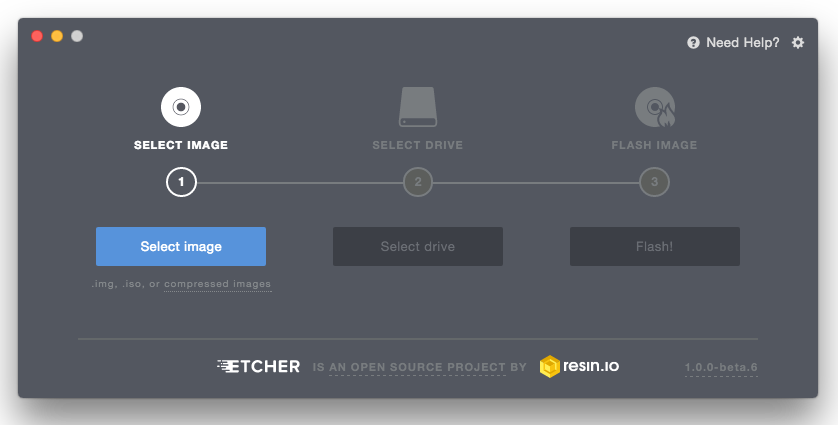

创建启动介质
=========================

现代的电脑上几乎很少使用光驱，因此我们采用U盘来进行安装。

如何制作U盘启动盘
--------------------------------

下载、安装、运行 `Etcher <https://etcher.io/>`_ 。

    使用Etcher

点击 :guilabel:`Select image`, 然后选择您的ISO文件。

点击 :guilabel:`Select drive`, 然后选择您的U盘。

点击 :guilabel:`Flash!`.

.. hint::
   也可以使用 `Win32 Disk Imager <https://sourceforge.net/projects/win32diskimager>`_ 来制作启动U盘。操作同上。
