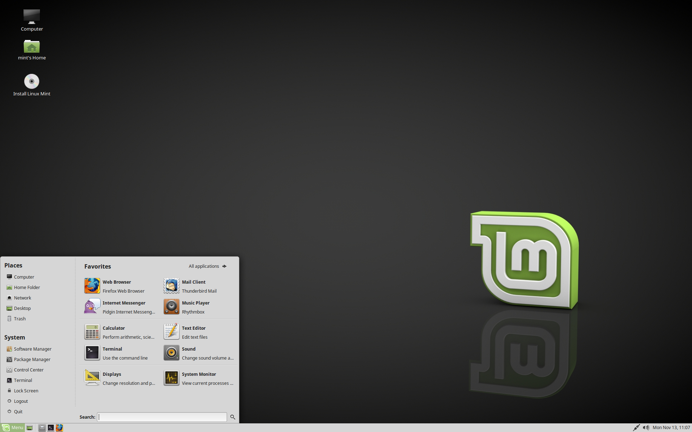
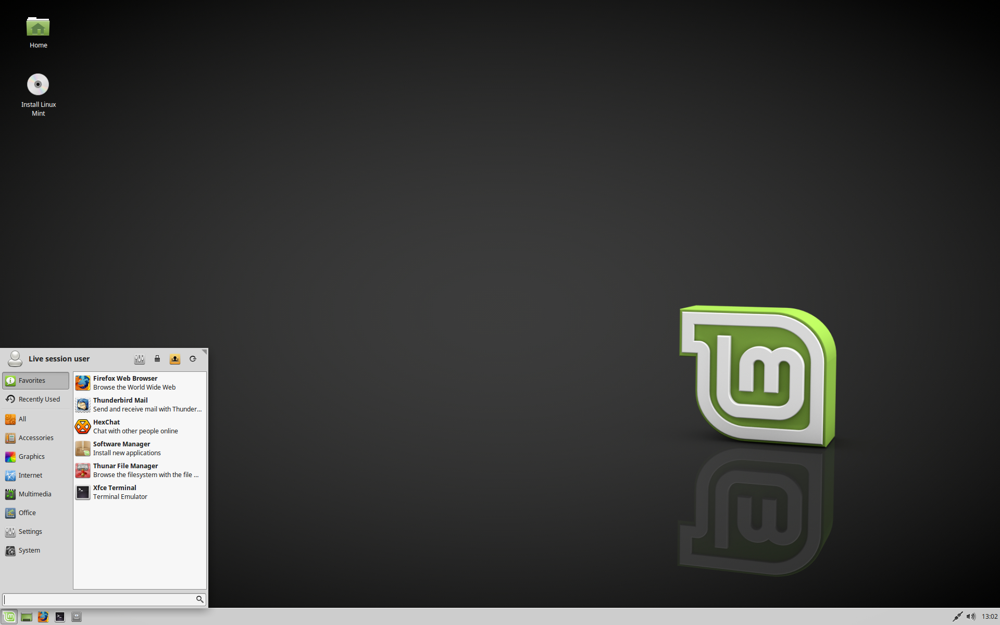

选择正确的版本
========================

您可以从 `Linux Mint website <https://linuxmint.com/download.php>`_ 下载 Linux Mint。

阅读下文以选择合适的版本和架构.

Cinnamon，MATE 还是 Xfce？
-----------------------

Linux Mint 有三种不同风格的版本，分别提供三种不同的桌面环境。

========  =====================================================
Cinnamon  最现代，最新颖，全功能的桌面
MATE      更稳定，更快的桌面
Xfce      最轻量级，最稳定
========  =====================================================

Linux Mint 最流行的版本是 Cinnamon 版。Cinnamon 是主要由 Linux Mint 团队开发，专为 Linux Mint 打造的桌面环境，流畅，美观，充满新特性。

.. figure:: images/cinnamon.png
    :width: 500px
    :align: center

    Cinnamon

Linux Mint 也参与了 MATE 的开发。MATE 是一个经典的桌面环境。它是 GNOME 2 的一个延续，在 2006 到 2011 年间曾作为 Linux Mint 的默认桌面环境。虽然它缺少一些新特性，开发也比 Cinnamon 要慢，但它运行更加快速，消耗更少资源，也比 Cinnamon 更加稳定。

    MATE

Xfce 是一个轻量级的桌面环境。它支持的特性没有 Cinnamon 和 MATE 那么多，但极其稳定，消耗极少的资源。

    Xfce

当然，三种桌面都非常优秀，Linux Mint 为每个版本都非常自豪。虽然有的版本提供更多的特性和更好的支持，有的版本则有更快的运行和更低的资源消耗，它们都是不错的选择，而选择合适的版本在很大程度上只取决于个人口味。

除了特性和性能之外，Cinnamon 、Mate 和 Xfce 还代表了三种不同的桌面环境，它们有不同的菜单，不同的面板和配置工具。让您感到舒适自在的桌面环境就是您最好的选择。

如果您不确定应该选取哪个桌面，可以从 Cinnamon 版开始。当您有时间的时候，可以把所有的版本都尝试一遍。每个版本在 Linux Mint 社区中都有自己的受众，也都十分流行。

32位还是64位？
-----------------

建议使用64位。

32位的ISO映像是为了与旧计算机兼容而提供的。目前32位的处理器已经非常罕见，大部分计算机都可以以64位运行。如果您的计算机出厂于2007年以后，其处理器很可能是64位的。

如果您有一台老计算机，并且不确定它是否能以64位运行，请阅读 `X86 Chronology <https://en.wikipedia.org/wiki/X86#Chronology>`_.

.. tip::
    您可以尝试在您的计算机上启动64位的 Linux Mint。即使它不兼容，也不会对计算机造成不良影响。您只会收到一条错误消息。
