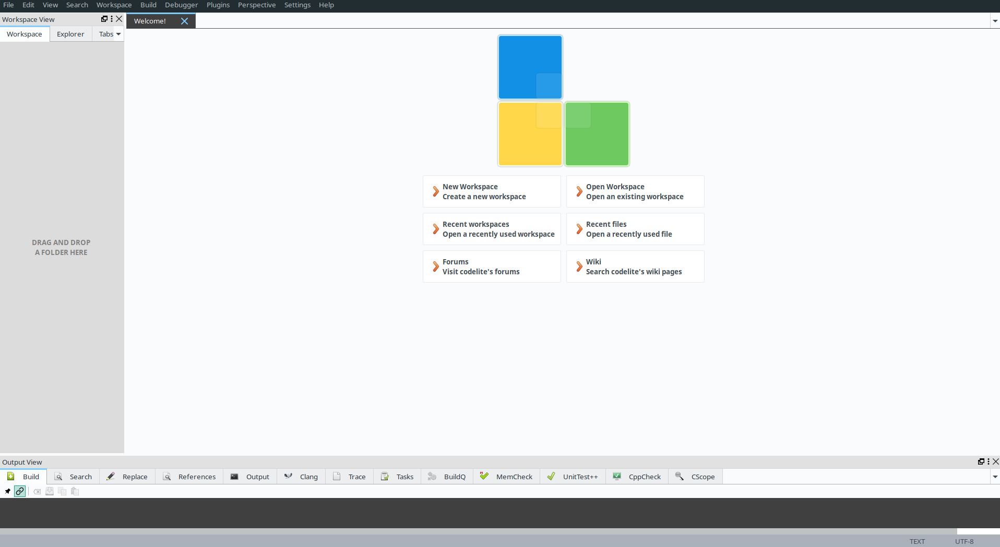
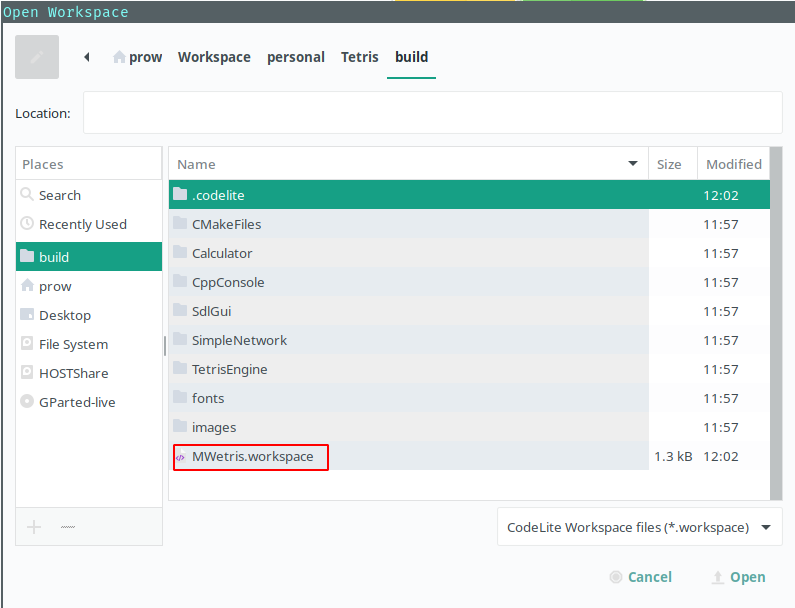
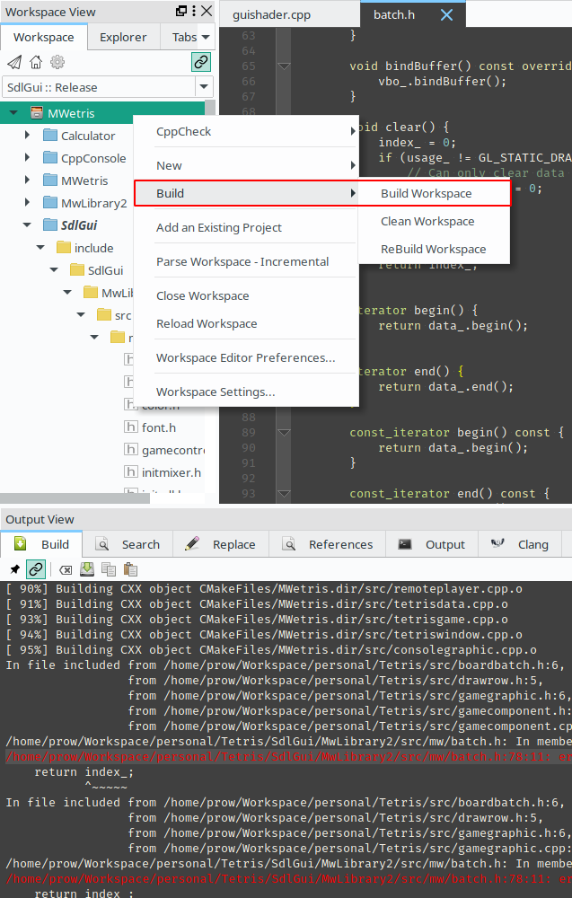

CodeLite的安装与使用
====================================

CodeLite是一款C/C++的开源IDE，它长的是这个样子：

安装CodeLite
------------------------------------
如果你使用的是Ubuntu 16.04或更新的版本，运行：

.. code-block:: shell

   sudo apt-get install codelite codelite-plugins

就可以了。

.. hint::
   可能Ubuntu官方源中的codelite版本不是最新的，你需要运行以下命令从 `CodeLite <https://codelite.org>`_ 自己的仓库中安装最新版本：

   .. code-block:: shell

      sudo apt-key adv --fetch-keys http://repos.codelite.org/CodeLite.asc
      sudo apt-add-repository "deb http://repos.codelite.org/ubuntu/ $(lsb_release -sc) universe"
      sudo apt-get update
      sudo apt-get install codelite wxcrafter

创建工程
------------------------------------
CodeLite的工程创建比较复杂，我个人喜欢写好CMake后，用CMake生成CodeLite的工程文件，
这样比较简单。命令如下：

.. code-block:: shell

   cmake .. -G "CodeLite - Unix Makefiles"

在成功cmake后， 会在当前目录下生成后缀名为 `.workspace` 和 `.project` 的文件，再
启动 `CodeLite`, 点击 :guilabel:`Open Workspace`, 选择相应的 `workspace` 文件即可：

    打开Workspace

编译工程
-----------------------------------
在成功导入工程后，右击 `Workspace`, 在弹出的菜单中点击 :guilabel:`Build` 就可以了，
编译的结果会在下方弹出窗口中显示：

    编译

编译的结果显示在上图下方的弹出式窗口中。 点击其中的错误，会自动跳到相应的文件。
