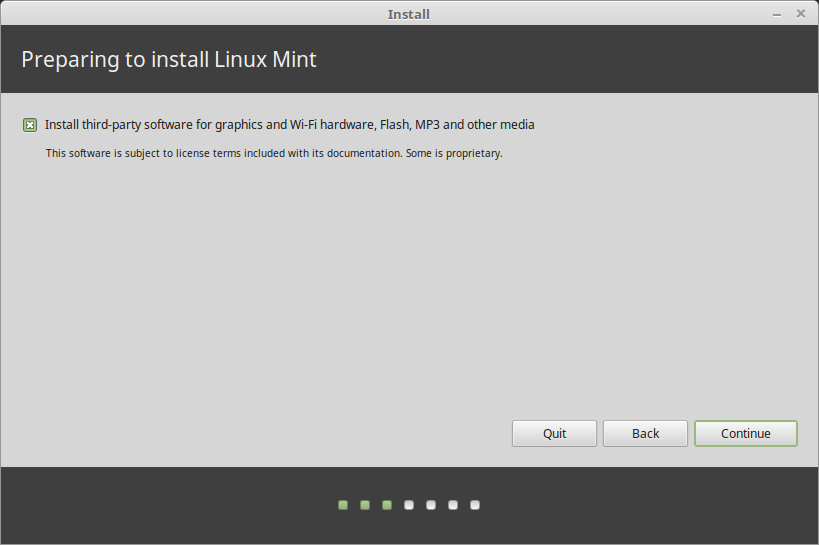

安装 Linux Mint
==================

临时会话
----------------

当你从U盘引导系统后， LinuxMint进入了一个 ``临时会话`` 。它会自动以用户名为 ``mint`` 的用户登录, 并有一个安装器在桌面上:

.. figure:: images/cinnamon.png
    :width: 500px
    :align: center

    The Linux Mint live session

``临时会话`` 与普通会话(例如在计算机上永久安装的Linux Mint)类似，但有以下例外情况：

* 临时会话运行比较慢(它是从一个u盘加载的，而不是SSD或HDD)。
* 你在临时会话中所做的更改不是永久的。它们没有被写入U盘，也不会影响通过安装程序安装的系统。
* 一些软件会在临时会话中不一样 (或者完全不一样，例如Timeshift, Flatpak, 更新管理器, 欢迎界面等等)。

.. hint::
   临时会话的用户名是 ``mint`` 。 如果要求输入密码，请按 :kbd:`Enter`.

在您的计算机上安装 Linux Mint
-------------------------------------

按以下步骤操作，以在你的电脑上永久的安装Linux Mint:

1. 双击 :guilabel:`Install Linux Mint`.

2. 选择你的语言。

.. figure:: images/installer-language.png
    :width: 500px
    :align: center

3. 连接的互联网。

.. figure:: images/installer-internet.png
    :width: 500px
    :align: center

4. 如果你想安装额外的多媒体解码器，请勾选下面的复选框。

5. 选择一种安装类型。

如果Linux Mint是你想在这个电脑上运行的唯一系统并且硬盘上所有的数据都可以丢失，选择 :guilabel:`Erase disk and install Linux Mint`.

.. note::

    如果你想自定义分区请选择 :guilabel:`Something else`.

    .. figure:: images/installer-partitions.png
        :width: 500px
        :align: center

    建议给根分区分配100G以上大小的空间，同时采用 ``ext4`` 文件系统。有关分区技巧，请参考 :doc:`partitioning` 。

    .. figure:: images/installer-partition.png
        :align: center

    还要创建一个 ``swap`` 分区， 大小和你的内存大小一样。

6. 选择你的时区。

7. 选择你的键盘布局。

.. figure:: images/installer-keyboard.png
    :width: 500px
    :align: center

8. 输入你的用户信息。

选用一个强密码。

9. 当安装完成，点击 :guilabel:`Restart Now`.

.. figure:: images/installer-finished.png
    :width: 500px
    :align: center

电脑在重启前会提示你移除U盘，照做就可以了。
