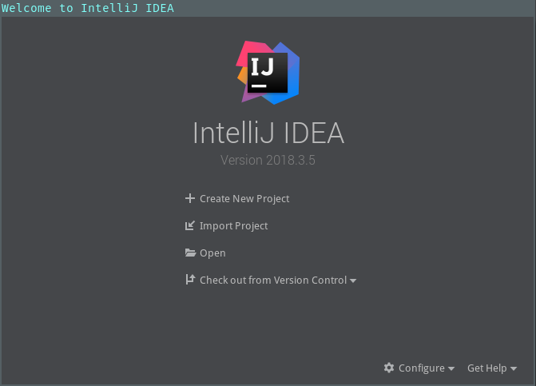

IntelliJ安装与使用简介
==============================
`IntelliJ` 是由JetBrains公司开发的IDE，其强大的功能使其成为开发Java的首选。

安装与运行
------------------------------
访问 `Download IntelliJ IDEA <https://www.jetbrains.com/idea/download/index.html#section=linux>`_ 并根据你的操作系统来下载相应的安装包。
下载完成后，解压就完成了安装。进入解压目录下的 `bin` 目录，运行 `idea.sh`. 启动完成后，界面如下：

SpringBoot HelloWorld Demo
------------------------------
下面为大家演示下怎么用 `IntelliJ` 创建SpringBoot的工程：

1. 在启动界面点击 :guilabel:`Create New Project`. 弹出以下界面：

   .. figure:: images/intellj_projtype.png
       :width: 500px
       :align: center

   选择左边的 :guilabel:`Spring Initializr`, 点击 :guilabel:`Next`.

2. 保持 `Project Metadata` 处于默认状态， 点击 :guilabel:`Next`.

   .. figure:: images/intellj_metadata.png
       :width: 500px
       :align: center

3. 这里我们只是做个简单的演示，只选择 `Web`.

   .. figure:: images/intellj_newproj1.png
       :width: 500px
       :align: center

4. 最后填写项目名称，路径，然后点击 :guilabel:`Finish`.

   .. figure:: images/intellj_newproj2.png
       :width: 500px
       :align: center

5. 让我们新建一个类，右击左侧的包名 `com.example.demo`, 在弹出的菜单中选择 :guilabel:`New -> JavaClass`, 我们给这个类起名为 `TestContoller`.

   .. figure:: images/intellj_newclass.png
       :width: 500px
       :align: center

6. 给这个类添加上代码， 让Spring能将针对 `http://127.0.0.1:8080/hello` 的请求进行处理。代码如下：

   .. code-block:: java

      package com.example.demo;

      import org.springframework.stereotype.Controller;
      import org.springframework.web.bind.annotation.RequestMapping;
      import org.springframework.web.bind.annotation.ResponseBody;

      @Controller
      public class TestController {

          @ResponseBody
          @RequestMapping("/hello")
          public String hello() {
              return "Hello World!";
          }
      }

   大家可以看到在输入代码的过程中不需要我们手动的引入用到的类，IntelliJ已经帮我们自动引入了，在这个代码中我们只是简单的返回了一个 `Hello World!` 字符串。

7. 点击界面右上角的 :guilabel:`Run` 按钮（在下图中用红框标出），启动我们的应用程序。

   .. figure:: images/intellj_runapp.png
       :width: 500px
       :align: center

   可以看到，在成功运行后， 底部弹出了一串Spring的Log。接着，打开浏览器访问 `http://127.0.0.1:8080/hello`. 应该出现下面的网页。

   .. figure:: images/intellj_hello.png
       :width: 500px
       :align: center
